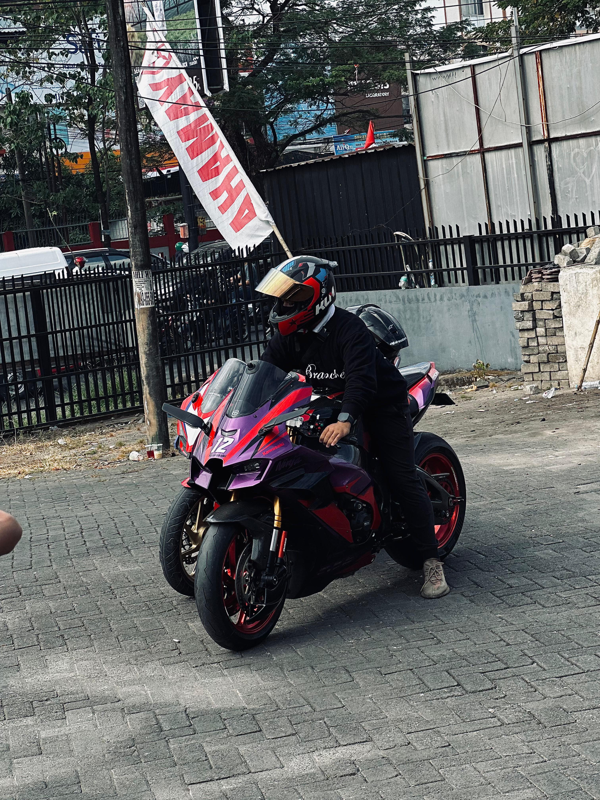

halo teman teman aku akbar, kali ini pada projek 3 kta membuat biografi kita sendiri ya!
---------------------------------------------------------------------------
biar semua tidak bingung aku bantu jelaskan satu satu isi dari tugas ini ya 
yan pertama kalaian akan melihat ada folder foto, nah disini itu kita menyimpan foto foto yang akan kita gunakan dalam projek ini 
seperti foto kita, logo aplikasi hingga foto yang akan kita maukkan ke dalam galeri foto kita.

lalu ada bigrafi.html, nah ini adalah file untuk membuat halaman pertama  dari biografi kita teman teman yang berisikan foto kita nama kita , pengenalan diri kita secara singkat, link menuju instagram, github dan juga tentang saya lebih lanjut 
pada file ini kita dapat mengatur bagaimana kita bisa menampilkan halaman yang menarik.

lalu ada tentang.html , file ini adalah halaman setelah kita menekan tombol tentang saya di halaman utama yang dibuat agaar memuat informasi pribadi dan juga  terlihat rapih .
lalu ada file css nya untuk kita mengatur tampilan, warna, ukuran font , ukuran gambar dan semacamnya agar tampilan lebih menarik untuk di terapkan pada websote kita.

untuk analisisnya bisa di lihat pada readme.md di dalam file
---------------------------------------------------------------------------

untuk yang pertama itu file biodata.html kita membuat dari awal seperti html, head nya, title dan body nya terlebih dahulu, agar dapat berbahasa indonesia kita memakai (html lang= id) lalu agar dapat tampil dengan baik di hp dan laptop kita mengguakan <meta name="viewport".....> 

<link rel="stylesheet"...> digunakan untuk menghubungkan file css yang kita buat agar dapat di pakai pada file ini
----------------------------------------------------------------------------
lalu di dalam body kita memakai 
 agar tempat tama dari biodata kita berbentuk seperti kartu, untuk menampilkan gambar kita memakai   dan di isi sesuai nama file foto yang akan kita gunakan 

setelah itu ada class bernama btn yang kita isi dengan href="...." sesuai link yang kita ingin masukkan contohnya instagram atau link github kita .
----------------------------------------------------------------------------
lalu pada file tentang html tadi kita membuat seperti awal pada biografi ,
lalu pada body kita membuat container untuk dijadikan wadah utama sebuah konte dengan bantuan 
 agar lebih rapih lalu mengelompokkan riwayat oendidikan di dalam  
 yang di dalam nya berisi alumni dari mana kita berasal, setelah itu di lanjut dengan membuat class hobi untuk di kelompokkan.

setelah itu kita membuat tempat untuk galeri foto kita dengan memasukkan gambar dengan cara  dan seterus nya.
---------------------------------------------------------------------------
pada bagian css kita menggunakan beberapa perintah yakni font family untuk mengubah font nya , lalu background nya dengan beberapa gabungan warna , ada color untuk menentukan warna pada beberapa tempat, 

ada text align untuk menentukan posisi dari text nya, setelah itu ada min-height untuk menentukan tinggi dari layar nya , dan display .... untuk menentukan posisi nya untuk di tengah layar. untuk membuar sudut menjadi melangkung kita menggunakan border-radius: 20px, dan boxshadow untuk membuat bayangan nya.

untuk membuat animasinya halus saat kursor mengenai blok kita menggunakan transision dan juga hover, dengan ini jadilah kita bisa menyusun animasi , warna pada biografi dan tentang saya untuk membuatnya lebih menarik.
---------------------------------------------------------------------------
sekian dari saya lebih dan kutang nya mohon di maafkan untuk lebih mengenal saya bisa follow ig saya yang ada di bio yaaa terimakasih !!!
